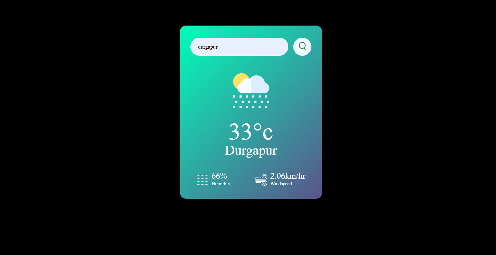

<h1 align ="center">Weather App</h1>
<h2><a href="https://hyperdevil-x.github.io/weather-app/" target="_blank">App Link</a></h2>

 <h3  align ="center"><b>Weather App using HTML5,CSS3,JAVASCRIPT</b></h3>
  

It is Weather App where you can check the weather condition of any valid city, which is developed on the HTML5,CSS3,JAVASCRIPT programming language which is used for frontend and also JAVASCRIPT is used for backend.

<ul>
 <h1><b>Programing Languages<b></h1>
<h2><b>Front-End</b></h2>
<li>HTML5</li>
 <li>CSS3</li>
 <li>JavaSCript</li>
</ul>
<ul>
<h2><b> Back-End </b></h2>
 <li>JavaSCript</li>
</ul>

